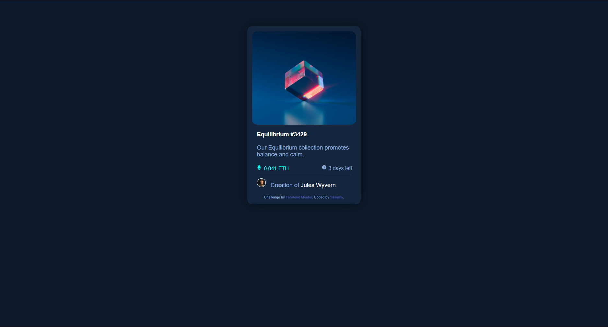

# Frontend Mentor - NFT preview card component solution

Esta é uma solução para o [NFT preview card component challenge on Frontend Mentor](https://www.frontendmentor.io/challenges/nft-preview-card-component-SbdUL_w0U).

## Table of contents

- [Introdução](#introdução)
  - [O desafio](#o-desafio)
  - [Screenshot](#screenshot)
  - [Links](#links)
- [Meu processo](#meu-processo)
  - [Construido com](#construido-com)
  - [O que eu aprendi?](#o-que-eu-aprendi)
  - [Recursos](#recursos)
- [Autora](#autora)

## Overview

### O desafio

Os usuários são capazes de:

- Visualizar o site indenpendente do tamanho da tela do dispositivo.
- Ver a interação do hover nos elementos.

### Screenshot

### Links

- Solution URL: [Add solution URL here](https://your-solution-url.com)

## Meu processo

### Construido com

- HTML
- CSS customizado
- Flexbox

### O que eu aprendi?

Aprendi a mexer melhor com flexbox e como alinhar eles na tela, além de revisar conceitos básicos sobre css.

### Recursos

- [A Complete Guide to Flexbox](https://css-tricks.com/snippets/css/a-guide-to-flexbox/) - Este artigo me ajudou a entender os conceitos básicos sobre flexbox.
- [FLEXBOX FROGGY](https://flexboxfroggy.com) - Este site me ajudou a entender flexbox e poder colocar em prática.

## Autora

- Website - [Yasmim Abrahão](https://tinyhero13.github.io/portifolio.github.io/)
- Frontend Mentor - [@TinyHero13](https://www.frontendmentor.io/profile/TinyHero13)
- GitHub - [@TinyHero13](https://github.com/TinyHero13)
